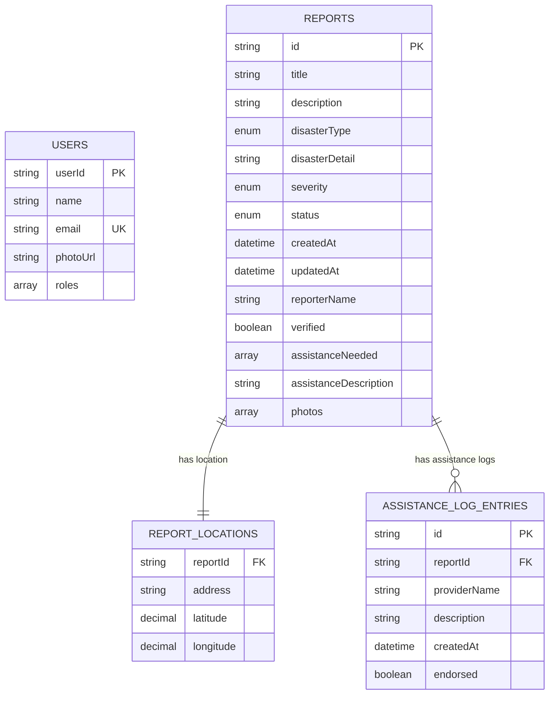

# Database Structure and Relationships

## Overview
This document outlines the database structure and entity relationships for the Disaster Impact Reporting System. The system manages disaster reports, users, assistance tracking, and related metadata.

## Core Entities

### 1. Users
**Table: `users`**

| Field | Type | Constraints | Description |
|-------|------|-------------|-------------|
| userId | String | PRIMARY KEY | Unique identifier for user |
| name | String | NOT NULL | Full name of the user |
| email | String | UNIQUE, NOT NULL | User's email address |
| photoUrl | String | NULLABLE | URL to user's profile photo |
| roles | Array<String> | NOT NULL | User roles (e.g., 'admin', 'user', 'responder') |

### 2. Reports
**Table: `reports`**

| Field | Type | Constraints | Description |
|-------|------|-------------|-------------|
| id | String | PRIMARY KEY | Unique identifier for report |
| title | String | NOT NULL | Brief title of the disaster report |
| description | String | NOT NULL | Detailed description of the incident |
| disasterType | Enum | NOT NULL | Type of disaster (see enum values below) |
| disasterDetail | String | NOT NULL | Specific details about the disaster type |
| severity | Enum | NOT NULL | Severity level: 'low', 'medium', 'high', 'critical' |
| status | Enum | NOT NULL | Report status: 'pending', 'verified', 'resolved' |
| createdAt | DateTime | NOT NULL | Timestamp when report was created |
| updatedAt | DateTime | NOT NULL | Timestamp when report was last updated |
| reporterName | String | NOT NULL | Name of the person who submitted the report |
| verified | Boolean | DEFAULT FALSE | Whether the report has been verified |
| assistanceNeeded | Array<String> | NOT NULL | Types of assistance required |
| assistanceDescription | String | NOT NULL | Detailed description of assistance needed |
| photos | Array<String> | DEFAULT [] | URLs to uploaded photos |

**Disaster Types Enum:**
- `flood`
- `fire`
- `earthquake`
- `storm`
- `drought`
- `landslide`
- `tsunami`
- `volcano`
- `hurricane`
- `tornado`
- `wildfire`
- `chemical_spill`
- `nuclear_incident`
- `industrial_accident`
- `structural_failure`
- `transportation_accident`
- `cyber_attack`
- `power_outage`
- `infrastructure_failure`
- `other`

### 3. Report Locations
**Table: `report_locations`**

| Field | Type | Constraints | Description |
|-------|------|-------------|-------------|
| reportId | String | FOREIGN KEY | References reports.id |
| address | String | NOT NULL | Human-readable address |
| latitude | Decimal | NOT NULL | Geographic latitude |
| longitude | Decimal | NOT NULL | Geographic longitude |

### 4. Assistance Log Entries
**Table: `assistance_log_entries`**

| Field | Type | Constraints | Description |
|-------|------|-------------|-------------|
| id | String | PRIMARY KEY | Unique identifier for log entry |
| reportId | String | FOREIGN KEY | References reports.id |
| providerName | String | NOT NULL | Name of assistance provider |
| description | String | NOT NULL | Description of assistance provided |
| createdAt | DateTime | NOT NULL | Timestamp when assistance was logged |
| endorsed | Boolean | DEFAULT FALSE | Whether the assistance is officially endorsed |

### 5. Report Statistics
**Table: `report_statistics`** (Aggregated/Computed)

| Field | Type | Description |
|-------|------|-------------|
| totalReports | Integer | Total number of reports |
| pendingReports | Integer | Number of pending reports |
| verifiedReports | Integer | Number of verified reports |
| resolvedReports | Integer | Number of resolved reports |
| recentReports | Integer | Number of recent reports |
| averageResponseTime | String | Average time to respond to reports |

## Entity Relationships

### Primary Relationships

### Relationship Details

1. **Reports ↔ Report Locations** (One-to-One)
   - Each report has exactly one location
   - Location data includes address and GPS coordinates
   - Used for mapping and proximity searches

2. **Reports ↔ Assistance Log Entries** (One-to-Many)
   - Each report can have multiple assistance log entries
   - Tracks the history of assistance provided
   - Includes provider information and endorsement status

3. **Implicit User Relationships**
   - Reports are created by users (via reporterName field)
   - Users with admin roles can verify and update reports
   - Assistance providers can be users or external organizations

## API Endpoints and Data Flow

### Report Submission Flow
1. User submits report via `POST /reports`
2. Report is created with status 'pending'
3. Location data is associated with the report
4. Photos are uploaded and URLs stored

### Report Management Flow
1. Admin users can update report status via `PATCH /reports/{id}/status`
2. Assistance providers add log entries via `POST /reports/{id}/assistance`
3. Reports can be searched and filtered via `GET /reports`

### Data Queries
- **Nearby Reports**: Use latitude/longitude with radius search
- **Filtered Reports**: Support filtering by disaster type, severity, status, date range
- **Statistics**: Aggregate data for dashboard display
- **Search**: Text-based search across report titles and descriptions

## Indexes Recommended

### Primary Indexes
- `reports.id` (Primary Key)
- `users.userId` (Primary Key)
- `assistance_log_entries.id` (Primary Key)

### Secondary Indexes
- `reports.status` (for filtering)
- `reports.disasterType` (for filtering)
- `reports.severity` (for filtering)
- `reports.createdAt` (for date-based queries)
- `report_locations.latitude, report_locations.longitude` (for geo queries)
- `assistance_log_entries.reportId` (for joining)
- `users.email` (for authentication)

## Data Constraints and Validation

### Business Rules
1. Reports must have a valid disaster type from the enum
2. Severity levels follow a hierarchy: low < medium < high < critical
3. Status transitions: pending → verified → resolved
4. Location coordinates must be valid latitude/longitude values
5. Assistance log entries can only be added to existing reports
6. Users must have valid email addresses

### Data Integrity
- Foreign key constraints ensure referential integrity
- Enum constraints prevent invalid disaster types and severity levels
- Date constraints ensure logical temporal relationships
- Geographic constraints ensure valid coordinate ranges

## Security Considerations

### Access Control
- Authentication required for report submission
- Admin roles required for report verification
- User roles control access to administrative functions

### Data Privacy
- Personal information (reporterName, contact details) should be handled according to privacy policies
- Photo uploads should be scanned for sensitive content
- Location data should be treated as sensitive information

## Performance Considerations

### Optimization Strategies
1. **Geospatial Queries**: Use spatial indexes for location-based searches
2. **Pagination**: Implement efficient pagination for large result sets
3. **Caching**: Cache frequently accessed data like statistics
4. **File Storage**: Use CDN for photo storage and delivery
5. **Search**: Consider full-text search indexes for report content

### Scaling Considerations
- Separate read replicas for reporting and analytics
- Archive old resolved reports to maintain performance
- Consider sharding by geographic region for large deployments
- Implement proper connection pooling for database access

---

*Last Updated: January 2024*
*Version: 1.0*