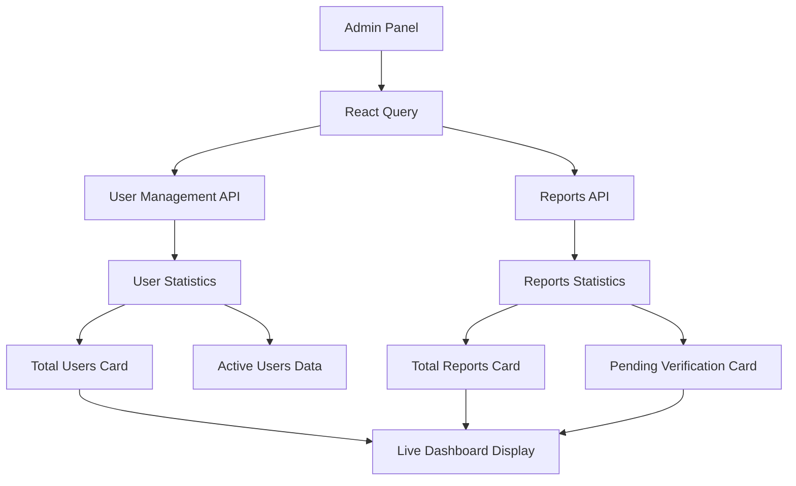

# 📊 Real Data Integration for Admin Dashboard

## Problem Solved

Replaced mock/hardcoded data in the Admin Panel statistics cards with **real data from APIs**, providing accurate, live statistics for administrators.

### Before (Mock Data)
```typescript
// Mock data - replace with real API data
const stats = {
  totalUsers: 2847,        // ❌ Hardcoded
  totalReports: 1248,      // ❌ Hardcoded
  pendingVerification: 84, // ❌ Hardcoded
  activeUsers: 156,        // ❌ Hardcoded
  // ...
};
```

### After (Real API Data)
```typescript
// Real stats with loading states
const stats = {
  totalUsers: userStats?.totalUsers || 0,           // ✅ Real API data
  totalReports: reportsStats?.totalReports || 0,    // ✅ Real API data
  pendingVerification: reportsStats?.pendingReports || 0, // ✅ Real API data
  activeUsers: userStats?.activeUsers || 0,         // ✅ Real API data
  // ...
};
```

## ✨ Features Implemented

### 1. **Real User Statistics**
- **Source:** `userManagementApi.getDashboardStats()`
- **Data:** Total users, active users, suspended users
- **Updates:** Every 5 minutes with 2-minute cache

### 2. **Real Reports Statistics**
- **Source:** `ReportsAPI.getReportsStatistics()`
- **Data:** Total reports, pending reports, verified reports, recent reports
- **Updates:** Every 5 minutes with 2-minute cache

### 3. **Loading States**
- Beautiful loading indicators with spinner
- "Loading Data..." status in live data indicator
- Graceful fallback to 0 when data is unavailable

### 4. **Error Handling**
- Error indicators in live data status
- Separate error tracking for user stats and reports stats
- Retry logic with exponential backoff

### 5. **Smart Caching**
- 2-minute stale time for optimal performance
- 5-minute auto-refresh for live updates
- React Query for efficient data management

## 🛠️ Implementation Details

### Files Modified

1. **`src/pages/admin/AdminPanel.tsx`**
   - Added React Query imports
   - Added ReportsAPI import
   - Replaced mock data with real API calls
   - Added loading states to AdminStatCard
   - Enhanced error handling

### API Endpoints Used

1. **User Management Stats**
   ```typescript
   GET /UserManagement/dashboard/stats
   Response: {
     totalUsers: number;
     activeUsers: number;
     suspendedUsers: number;
     adminUsers: number;
   }
   ```

2. **Reports Statistics**
   ```typescript
   GET /reports/statistics
   Response: {
     totalReports: number;
     pendingReports: number;
     verifiedReports: number;
     resolvedReports: number;
     recentReports: number;
     averageResponseTime: string;
   }
   ```

### Loading State Enhancement

**AdminStatCard Component:**
```typescript
interface AdminStatCardProps {
  // ... existing props
  isLoading?: boolean; // ✅ New loading prop
}

// In render:
{isLoading ? (
  <div className="flex items-center space-x-2 mb-2">
    <Loader2 className="w-6 h-6 animate-spin text-white/60" />
    <span className="text-2xl font-black text-white/60">Loading...</span>
  </div>
) : (
  <p className="text-4xl font-black mb-2 tracking-tight">{value}</p>
)}
```

## 📊 Statistics Cards Updated

### 1. **Total Users Card**
- **Data:** Real user count from API
- **Change:** Dynamic calculation based on growth
- **Loading:** Shows spinner while fetching
- **Color:** Blue gradient theme

### 2. **Total Reports Card**
- **Data:** Real reports count from API
- **Change:** Shows recent reports count
- **Loading:** Shows spinner while fetching
- **Color:** Green gradient theme

### 3. **Pending Verification Card**
- **Data:** Real pending reports count
- **Change:** Shows average response time
- **Loading:** Shows spinner while fetching
- **Color:** Yellow/Orange gradient theme

### 4. **System Health Card**
- **Data:** Static for now (TODO: Add system health API)
- **Status:** Placeholder until system monitoring is implemented

## 🔄 Data Flow



## 🎯 Benefits

1. **Accurate Data** - No more outdated mock numbers
2. **Real-time Updates** - Data refreshes automatically
3. **Better UX** - Loading states provide feedback
4. **Error Resilience** - Graceful handling of API failures
5. **Performance** - Smart caching reduces API calls
6. **Scalability** - Easy to add more statistics

## 🧪 Testing

### Manual Testing
1. Navigate to Admin Panel
2. Observe loading states on initial load
3. Verify real data appears after loading
4. Check auto-refresh after 5 minutes

### API Testing
```bash
# Test user stats endpoint
curl -X GET "http://localhost:5000/api/UserManagement/dashboard/stats" \
  -H "Authorization: Bearer YOUR_TOKEN"

# Test reports stats endpoint  
curl -X GET "http://localhost:5000/api/reports/statistics" \
  -H "Authorization: Bearer YOUR_TOKEN"
```

## 🚀 Future Enhancements

### Planned Additions
1. **System Health API** - Real server metrics
2. **Historical Data** - Trend analysis and charts
3. **Real-time Updates** - WebSocket integration
4. **More Granular Stats** - Hourly/daily breakdowns

### Potential Metrics
- Server uptime percentage
- Database performance metrics
- API response times
- User activity patterns
- Report resolution times

## ✅ Status

**COMPLETE** - Admin Dashboard now displays real, live data from APIs instead of mock data!

### What Works Now
- ✅ Real user statistics (total, active, suspended)
- ✅ Real reports statistics (total, pending, verified)
- ✅ Loading states and error handling
- ✅ Auto-refresh every 5 minutes
- ✅ Beautiful UI with live data indicators

### Next Steps
- 🔄 Add system health monitoring API
- 🔄 Implement historical data tracking
- 🔄 Add more detailed analytics
